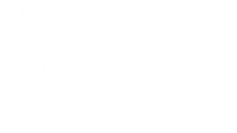

# CatMapR

<p>
  
  
  
</p>


**CatMapR** is an R package that provides an interface to the [CatMapper API](https://catmapper.org), facilitating access to dataset catalog metadata, categories, and entities managed within CatMapper's systems, including `SocioMap` and `ArchaMap`. CatMapper organizes complex category systems—such as ethnicities, languages, religions, political districts, and artifacts—frequently used in social science and archaeological research.

This package allows users to:

* Retrieve dataset catalog metadata from CatMapper databases.
* Search for specific categories or entities and obtain detailed information.
* Translate terms within datasets based on domain-specific categories, enabling data consistency and integration across diverse datasets.
* Create and join datasets across different domains for integrated analysis.

## Installation

Currently, **CatMapR** is only available on GitHub. To install it, use the following commands in R:

```r
# Install remotes if not already installed
install.packages("remotes")

# Install CatMapR from GitHub
remotes::install_github("projectCatMapper/CatMapR")
```

## Package Overview

The **CatMapR** package includes the following main functions:

- **`listDatasetMetadata`**: Preferred alias for listing dataset catalog metadata in a specified database (`SocioMap` or `ArchaMap`).
- **`allDatasets`**: Legacy-compatible name for `listDatasetMetadata()`.
- **`callAPI`**: Helper function for calling the CatMapper API with specified parameters.
- **`CMIDinfo`**: Fetches details about a specific entity by CatMapper ID (CMID).
- **`createLinkfile`**: Proposes and returns a merge of datasets based on a category domain and specified datasets.
- **`getDatasetMetadata`**: Preferred alias for retrieving metadata for a dataset CMID.
- **`datasetInfo`**: Legacy-compatible name for `getDatasetMetadata()`.
- **`joinDatasets`**: Joins two datasets based on specified parameters, returning the joined data with translated keys.
- **`searchDatabase`**: Searches for terms within a database, allowing filtering by domain, property, year, and context.
- **`translate`**: Translates terms within datasets by matching specified properties and domains, facilitating category consistency across data sources.
- **`uploadInputNodes`**: Uploads edit-page rows to CatMapper's `/uploadInputNodes` endpoint (write operation; API key required).
- **`updateWaitingUSES`**: Triggers `/updateWaitingUSES` after uploads (write operation; API key required).
- **`submitEditUpload`**: Runs the same two-step flow as the CatMapperJS edit page: upload, then waiting-USES refresh.

### What CatMapR Returns

- **Returns metadata and API responses**, including dataset catalog fields (for example CMID, CMName, citations, relationships), category matches, and translation/join outputs.
- **Does not download dataset source files** managed outside CatMapper. User-owned raw datasets remain external inputs to your R workflow.

### UI-to-R Function Mapping

Route placeholder note[^database-route].

| CatMapperJS route | UI workflow | CatMapR functions |
| --- | --- | --- |
| `/:database/explore` | Search and inspect entities/categories | `searchDatabase()`, `CMIDinfo()` |
| `/:database/translate` | Translate labels and review proposed matches | `translate()` |
| `/:database/merge` | Propose key mappings and join aligned tables | `createLinkfile()`, `joinDatasets()` |
| `/:database/edit` | Authenticated edit upload and waiting-USES refresh | `uploadInputNodes()`, `updateWaitingUSES()`, `submitEditUpload()` |

[^database-route]: In routes like `/:database/explore`, `:database` means the app path segment, typically `sociomap` or `archamap` (for example `/sociomap/explore`).

## Usage

Here are examples of how to use the primary functions in **CatMapR**.

### Configure API URL (Optional)

Set `CATMAPR_API_URL` to point to a different CatMapper API deployment:

```r
Sys.setenv(CATMAPR_API_URL = "https://api.catmapper.org")
```

### Write Access and Authentication

Write endpoints (for example uploads) require a valid API key from a registered CatMapper account:

```r
Sys.setenv(CATMAPR_API_KEY = "cmk_your_api_key")
```

- How to get an API key: https://catmapper.org/help/API.html#api-key-access
- For write calls, CatMapper identifies the acting user from the API key on the server side.
- Server-side permissions determine whether that user can run the requested write action.
- CatMapR does not implement username/password login flows; it sends API-key-authenticated requests to the API.

### Retrieve Dataset Catalog Metadata

```r
# Preferred metadata-focused alias
dataset_catalog <- listDatasetMetadata(database = "SocioMap")
print(dataset_catalog)

# Legacy equivalent
# all_datasets <- allDatasets(database = "SocioMap")
# print(all_datasets)
```

### Retrieve Metadata for a Dataset CMID

```r
# Preferred metadata-focused alias
dataset_meta <- getDatasetMetadata(database = "SocioMap", CMID = "SD1", domain = "CATEGORY")
print(dataset_meta)

# Legacy equivalent
# dataset_meta <- datasetInfo(database = "SocioMap", CMID = "SD1", domain = "CATEGORY")
# print(dataset_meta)
```

### Retrieve Details for a Specific CMID

```r
# Retrieve information for a specific CatMapper ID (e.g., "SM1") in SocioMap
cmid_info <- CMIDinfo(database = "SocioMap", cmid = "SM1")
print(cmid_info)
```

### Create Linkfile for Dataset Merges

```r
# Create a linkfile to merge datasets based on the ETHNICITY domain
merged_data <- createLinkfile(
  categoryLabel = "ETHNICITY",
  datasetChoices = c("SD5", "SD6"),
  database = "SocioMap",
  equivalence = "standard"
)
print(merged_data)
```

### Join Datasets by Key

```r
# Join two datasets by matching keys in the SocioMap database
joinLeft <- data.frame(datasetID = "SD1", country = "Afghanistan", GID = "AFG", val0 = 1)
joinRight <- data.frame(datasetID = "SD2", country = "Afghanistan", geonameid = "1149361", val1 = 2)
joined_data <- joinDatasets(
  database = "SocioMap",
  joinLeft = joinLeft,
  joinRight = joinRight,
  domain = "CATEGORY"
)
print(joined_data)
```

### Search the Database

```r
# Search for the term "Afghanistan" in the ETHNICITY domain of SocioMap
search_results <- searchDatabase(
  database = "SocioMap",
  domain = "ETHNICITY",
  term = "Afghanistan",
  property = "Name"
)
print(search_results$data)
```

### Translate Terms within a Dataset

```r
# Translate a dataframe containing a "country" column, matching with SocioMap's ADM0 domain
df <- data.frame(country = "Afghanistan")
translated_df <- translate(
  rows = df,
  database = "SocioMap",
  domain = "ADM0",
  term = "country",
  property = "Name"
)
print(translated_df$file)
```

### Upload Edit-Page Data (Write API)

```r
upload_payload <- data.frame(
  CMName = "Yoruba",
  Name = "Yoruba",
  Key = "eth:yoruba",
  stringsAsFactors = FALSE
)

result <- submitEditUpload(
  df = upload_payload,
  database = "SocioMap",
  formData = list(
    domain = "ETHNICITY",
    subdomain = "ETHNICITY",
    datasetID = "SD1",
    cmNameColumn = "CMName",
    categoryNamesColumn = "Name",
    alternateCategoryNamesColumns = character(0),
    cmidColumn = "CMID",
    keyColumn = "Key"
  ),
  so = "simple",
  ao = "add_uses",
  api_key = Sys.getenv("CATMAPR_API_KEY")
)

print(result$upload)
```

## Dependencies

CatMapR relies on the following R packages:
- `httr`: For making HTTP requests to the CatMapper API.
- `jsonlite`: For handling JSON responses.
- `tictoc`: For timing API calls.

## License

CatMapR is licensed under the GNU General Public License (GPL).
